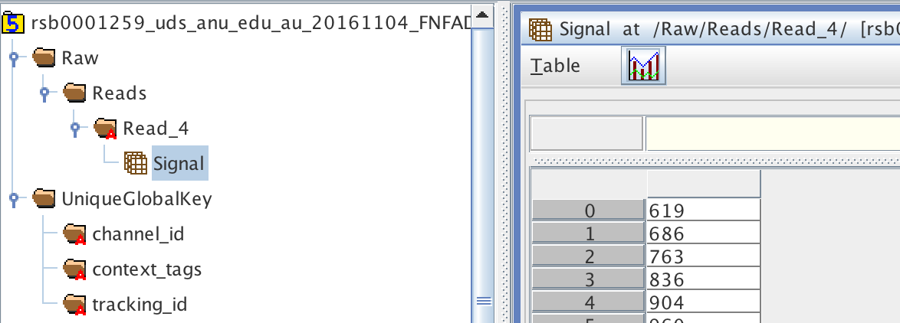

pandoc brachy.md --smart --standalone --bibliography test.bib -o brachy.pdf

## Section Goals
- Understand the initial data that is coming from your MinION run
- What is contained within the `fast5` datafiles
- What we can, and cannot, do with the data at this point

## General pipeline so far:

- The MinKNOW software on the sequencing laptop facilitates the collection and parsing of data from the MinION flowcell.
- This 'raw' data is voltage traces that are measured at 5khz (5 thousands times per second).
- The voltage across the membrane changes as molecules enter, move through, and exit each sequencing pore.
  - This entire measurement is called an 'event' which will be the collected signal measurements for that molecule.
- The software recognizes this initial voltage change and begins writing out the trace to a new `fast5` file.
- There is **one file per DNA molecule** that passes through each pore. Therefore many files are created!
  - Hence, the requirement for high quality transfer speeds on your laptop to facilitate this (SSDs)
  - This is a fundamental shift from Illumina platforms in which most analysis is based off of fewer, but much larger, files.

## The initial data is NOT basecalled

- At this point, we do not have nucleotide information, just voltage traces.
- We can look at this information within the fast5 files that are created.

## What are `fast5` files?

- Each file contains signal trace for a single DNA molecule
- `fast5` files are stored in the `HDF5` file format.
- `HDF5` acts as a larger organizational framework (box) in which different types of data can be stored in a hierarchical way.
  - Like directories, sub-directories, and files/data on your computer.

- The `HDF5` format is quite flexable in being able to contain a wide variety of data types internally (strings,int,float,arrays, etc) within the single 'HDF5' format.

- The `fast5` files are therefore able to not only hold the signal trace, but also a wide variety of metadata related to how it was created, timestamps, software versions, etc.

- The format allows for new items to be added to it over time, creating a single container from raw information onwards
  - We will see this shortly.

- We can investigate any `fast5` file using an `HDF5` 'viewer' which will show the internal structure and datasets in an easy-to-examine GUI.

- The group that created the `HDF5` format [provides a java-based viewing software to download:](https://support.hdfgroup.org/products/java/release/download.html)
  - [HDFView for windows](ftp://130.56.254.90/pub/HDF5View_local_download/HDFView-2.13-win64.zip)
  - [HDFView for OSX](ftp://130.56.254.90/pub/HDF5View_local_download/HDFView-2.13.dmg)
  - [HDFView for Linux](ftp://130.56.254.90/pub/HDF5View_local_download/HDFView-2.13.0-centos6-x64.tar.gz)

- There are also [command-line tools to viewing HDF5 files for those interested](https://support.hdfgroup.org/HDF5/Tutor/cmdtoolview.html)

## Where are the `fast5` files located?

- As sequencing begins, data beings to be filled in to the `./reads` directory within your MinKNOW install folder:

As of MinKNOW v1.6.11:

Windows:
OSX: `/Library/MinKNOW/data/reads/`
Linux:

## Let's take a look at a `fast5` file

## Additional Notes

- Remember that everything is rapidly-changing! What you learn now will likely be redundant and/or wrong with the MinION practices six months from now.

- ONP wants to move towards elimination of `fast5` files and have MinKNOW basecall directly to fastq files (you never seen these steps)

- This is largely useful information for those interested in the deep technical information of MinION tech as well as those interested in working directly with sequence traces (new basecalling methods, etc)
